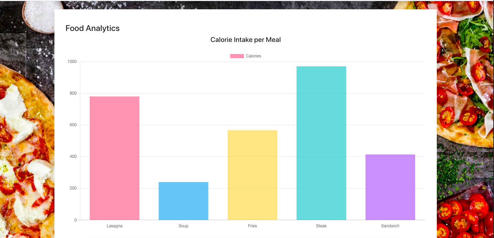
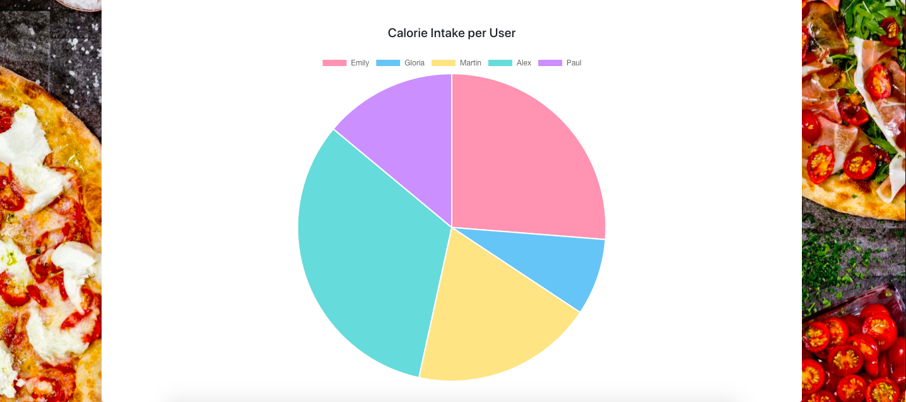
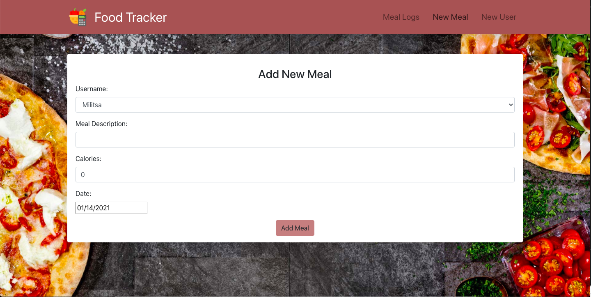

# FoodTracker
Food and Calorie Intake Tracker Web Application with MERN Stack

## What it does
The application lets users input their meal and calorie intake. It enables multiple users to track their food and produces graphs showing the calorie intake per user and per meal. The meals processing system is implemented such that it to enables CRUD operations on each meal log. Thus, users can add, edit and delete meals and observe data analytics concerning their food intake. This web application was inspired from freeCodeCamp.org.

### Built with
This application was built using the MERN Stack. 
* [CSS](https://www.w3schools.com/css/) 
* [Express.js](https://expressjs.com/) 
* [React](https://reactjs.org/)  
* [HTML](https://www.w3schools.com/html/) 
* [Node.js](https://nodejs.org/en/) 
* [postman](https://www.postman.com/) 

