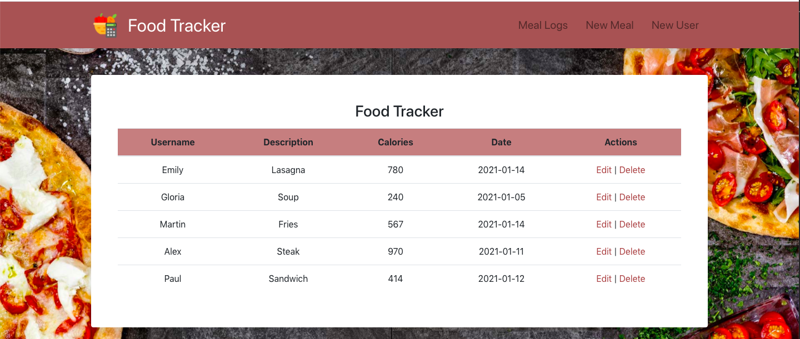

# FoodTracker
Food and Calorie Intake Tracker Web Application with MERN Stack

## What it does

## How we built it
We used MongoDB, Express, and Node.js to build the backend and subsequent matching algorithm. The backend calls the google places API to fetch the restaurant info that will be displayed on the matching page. For the frontend, we first made static mockups using HTML, CSS, Bootstrap, and Vanilla Javascript, and then later ported these mockups over to React.

### Built with
* [CSS](https://www.w3schools.com/css/) 
* [Express.js](https://expressjs.com/) 
* [React](https://reactjs.org/) 
 
* [HTML](https://www.w3schools.com/html/) 
* [Node.js](https://nodejs.org/en/) 
* [postman](https://www.postman.com/) 

